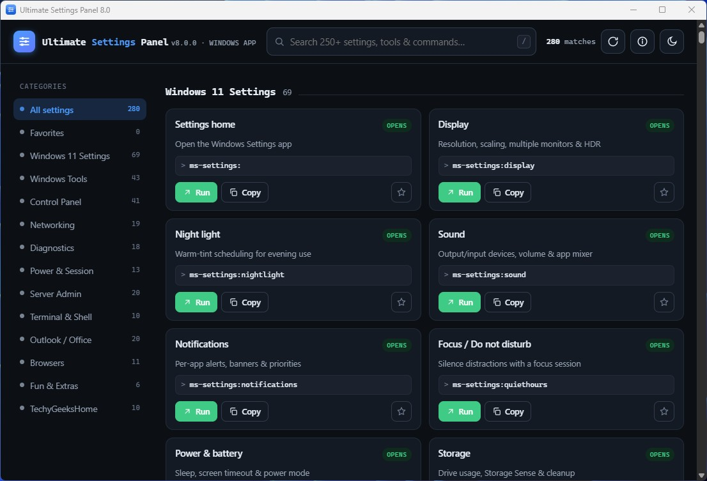
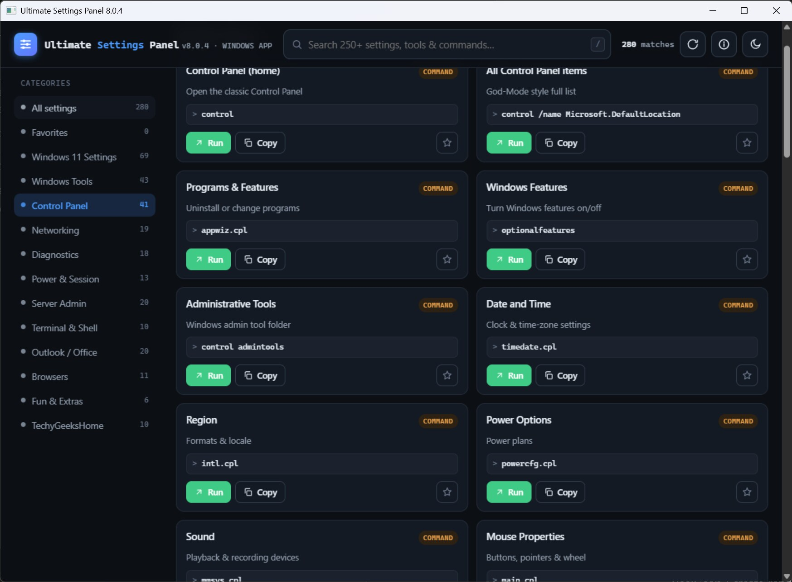
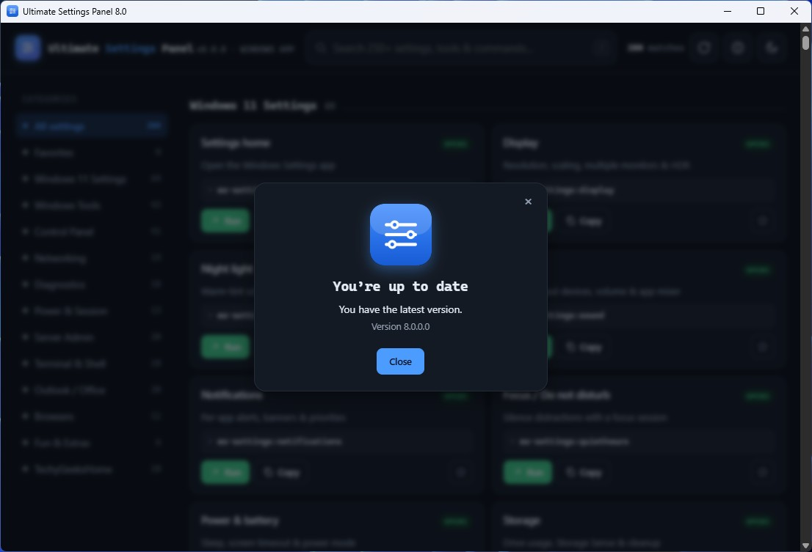
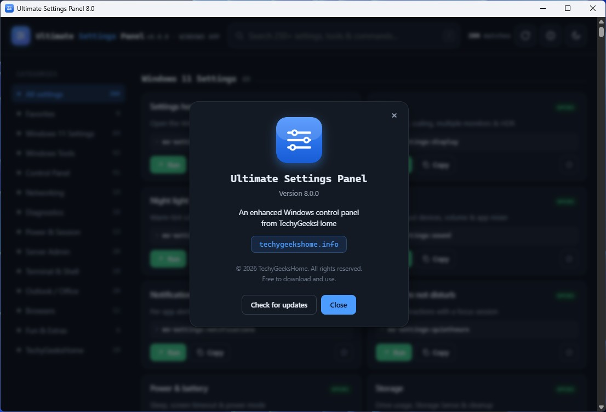
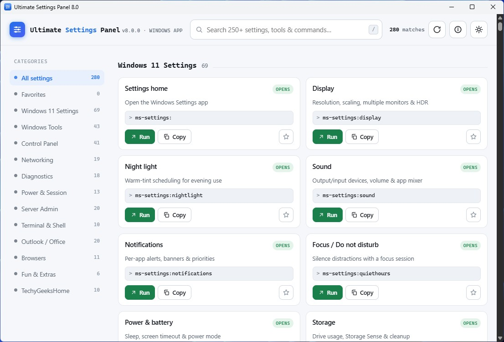
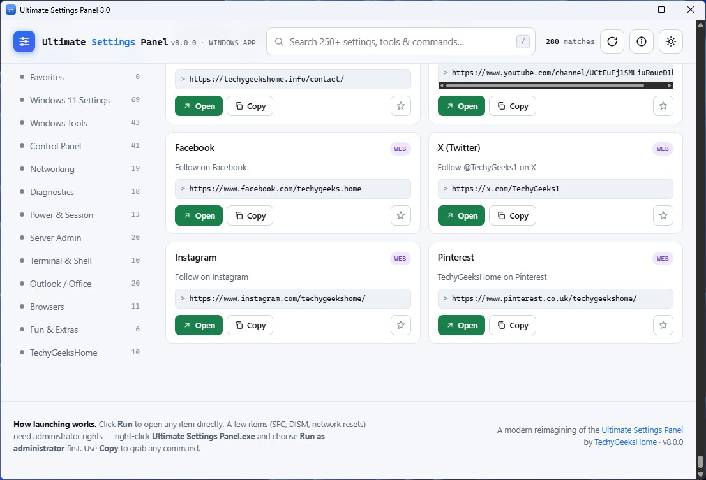
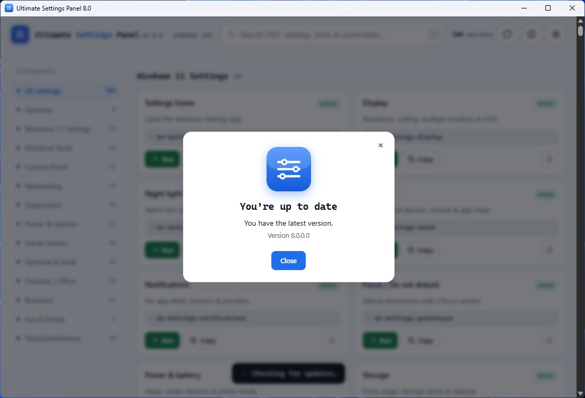
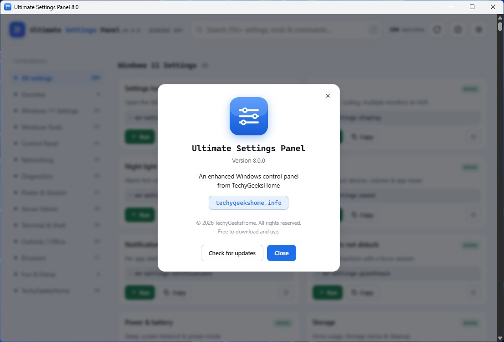

<div align="center">


# Ultimate Settings Panel 8.0

**Every Windows setting, tool and command — in one fast, searchable place.**

[](https://github.com/techygeekshome/Ultimate-Settings-Panel/releases)
[](#-download--run)
[](https://techygeekshome.info/ultimate-settings-panel-online/)
[](https://techygeekshome.info)
[](https://ko-fi.com/techygeekshome)

[Download](#-download--run) · [Features](#-what-it-does) · [Video](#-see-it-in-action) · [Screenshots](#-screenshots) · [How it works](#%EF%B8%8F-how-launching-works) · [Build from source](#-build-from-source) · [Changelog](CHANGELOG.md)

</div>

---

A modern, ground-up rebuild of the classic TechyGeeksHome **Ultimate Settings Panel** — a native Windows app *and* a portable web app, replacing the original C#/WinForms program from 2020. No install, no dependencies, and no network connection unless you press Check for updates.

## 🎬 See it in action

[](https://www.youtube.com/watch?v=ATa4AXIVzvM)

A full walkthrough of the panel — search, categories, themes and launching settings.

## 📸 Screenshots

<p float="left">
  
  
</p>
<p float="left">
  
  
</p>
<p float="left">
  
  
</p>
<p float="left">
  
  
</p>

## ⬇️ Download & run

| Edition | What it is | Get it |
| --- | --- | --- |
| 🖥️ **Windows app** *(recommended)* | Native app — every card has a **Run** button that launches the tool or setting directly. Windows 10 & 11. | [**Download for Windows**](https://techygeekshome.info/product/ultimate-settings-panel-app/) — free |
| 🌐 **Web edition** | Runs straight in your browser, on any device. Use **Copy** / **Get .bat** for classic commands. | [**Open the web edition**](https://techygeekshome.info/ultimate-settings-panel-online/) |

> [!NOTE]
> **First run of the Windows app:** if you see a blue *"Windows protected your PC"* box, that's only because the app isn't code-signed — click **More info → Run anyway**. A few items (SFC, DISM, network resets) need **Run as administrator** (right-click the app).

## ✨ What it does

Puts **250+ Windows settings, tools, diagnostics and commands** behind one search box, across 12 categories plus Favourites:

> Windows 11 Settings · Windows Tools · Control Panel · Networking · Diagnostics · Power & Session · Server Admin · Terminal & Shell · Outlook / Office · Browsers · Fun & Extras · TechyGeeksHome

- 🔎 **Instant search** across names, descriptions and the underlying commands.
- 🚀 **Windows 11 `ms-settings:` deep links** that open the real Settings pages directly.
- 🛠️ **Modern diagnostics** — `sfc /scannow`, `DISM …/RestoreHealth`, battery & energy reports, Wi-Fi report, Winsock / TCP-IP reset, and more.
- 💻 **Terminal & Shell** — Windows Terminal, PowerShell 7, and `winget` app management.
- ⭐ **Favourites**, 🌗 **light / dark theme**, 📋 **Copy**, and 💾 **.bat export**.
- 🔒 **Private** — no analytics, no tracking, no telemetry.

## 🖱️ How launching works

| Where | Behaviour |
| --- | --- |
| **Windows app** | Every item has a **Run** button that launches it directly, via a small JavaScript↔Go bridge — no `mshta`, no dropped scripts. |
| **Web edition** | Browsers can't run programs for safety, so classic commands use **Copy** and **Get .bat** instead. `ms-settings:` and web links still open directly. |

The Windows app renders the panel in a **Microsoft Edge WebView2** window (Chromium), which ships with Windows 11 and up-to-date Windows 10. If it's ever missing, the app links straight to Microsoft's free installer.

## 🔧 Build from source

The desktop app is a small Go program (no CGO). With [Go 1.24+](https://go.dev/dl/):

```sh
GOOS=windows GOARCH=amd64 CGO_ENABLED=0 \
  go build -trimpath -ldflags="-H windowsgui -s -w" -o "Ultimate Settings Panel.exe" .
```

Two HTML files, and they are not the same file:

| File | What it is |
|---|---|
| `panel.html` | The desktop panel. `main.go` embeds it, so this is what ships inside the `.exe`. |
| `index.html` | The web edition. Open it in a browser, or [run it on the site](https://techygeekshome.info/ultimate-settings-panel-online/). Nothing else needed. |

The desktop build is otherwise the same panel in a WebView2 window. The only thing the Go
side adds is answering "is there a newer version?", because a page loaded from a `data:`
URL cannot call GitHub for itself.

### On the one network call

Ultimate Settings Panel makes exactly one network request, and only when you click
**Check for updates**. It asks GitHub's public releases API whether a newer tag exists.
The request carries a user agent naming the app, its version and this site, because GitHub
rejects requests without one — and nothing else. No machine identifier, no record of which
settings you opened, no usage data. It never downloads or installs anything: if there is a
newer version it offers a link to the release page, and that is all.

**Nothing is requested when the app starts.** Open it, use it, close it, and it makes no
network connection at all. Version 8.0.0 did quietly check on every launch; 8.0.1 does not,
and the build workflow fails if that behaviour ever comes back.

## 📜 What's new in 8.0

Rebuilt from the ground up: a native Windows app **and** a portable web app (the original was a C#/WinForms app on the unmaintained MetroFramework). Removed what no longer works — Google Analytics, Internet Explorer, dead telnet "tricks", Google+ links — and added the Windows 11 Settings, Terminal & Shell and modern diagnostics categories, favourites, themes, and `.bat` export.

See [`CHANGELOG.md`](CHANGELOG.md) for the full list.

## 🐛 Support & contributing

Found a bug or have a request? [Open an issue](https://github.com/techygeekshome/Ultimate-Settings-Panel/issues) or [get in touch](https://techygeekshome.info/contact/).

## 📄 License

© 2026 TechyGeeksHome. All rights reserved.

Ultimate Settings Panel is free to download and use. This is proprietary freeware, not open source — see [`LICENSE`](LICENSE) for the full terms.

---

<div align="center">

Made with ❤️ by [**TechyGeeksHome**](https://techygeekshome.info)

[Website](https://techygeekshome.info) · [YouTube](https://www.youtube.com/channel/UCtEuFj1SMLiuRoucD1hv8dA) · [X](https://x.com/TechyGeeks1) · [Facebook](https://www.facebook.com/techygeeks.home) · [Instagram](https://www.instagram.com/andrewarmstrongtgh/)

</div>
